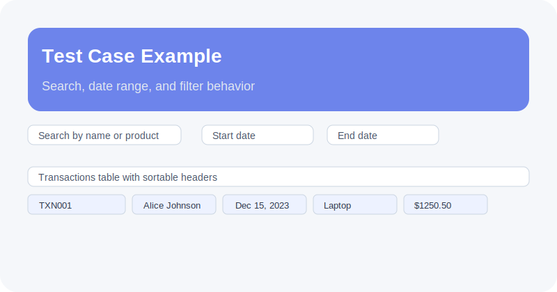

# Customer Rewards Program

A React application that calculates customer reward points based on purchase transactions and displays:

- **Customer monthly reward summaries**
- **Total rewards by customer**
- **Transaction-level point detail**

This solution uses React JS without TypeScript or Redux.

## Overview

The app processes mock transactions for customers across three consecutive months, including December 2023, January 2024, and February 2024. It aggregates reward points by customer, month, and total, while handling decimals and year boundaries.

## Test Case Example




## Reward Points Rules

Points are awarded per transaction as follows:

- **2 points** for every dollar spent over $100
- **1 point** for every dollar spent between $50 and $100
- **0 points** for amounts $50 and below

### Example Calculation

- `$120` → 90 points
- `$100.2` → 50 points
- `$75.5` → 25 points

## Project Structure

```
react-rewards-app/
├── src/
│   ├── components/
│   │   ├── LoadingSpinner.js          # Loading state component
│   │   ├── LoadingSpinner.css          # Loading spinner styles
│   │   ├── MonthlyRewardsTable.js     # Monthly rewards display table
│   │   ├── MonthlyRewardsTable.css     # Monthly table styles
│   │   ├── TotalRewardsTable.js       # Total rewards summary table
│   │   ├── TotalRewardsTable.css       # Total rewards styles
│   │   ├── TransactionsTable.js       # Transaction details table
│   │   ├── TransactionsTable.css       # Transaction table styles
│   │   ├── ErrorBoundary.js           # Error boundary component
│   │   └── ErrorBoundary.css           # Error boundary styles
│   ├── data/
│   │   └── mockData.js                 # Mock customer transaction data
│   ├── services/
│   │   ├── api.js                      # API service with async simulation
│   │   └── api.test.js                 # API service tests
│   ├── utils/
│   │   ├── rewardsCalculator.js        # Pure calculation functions
│   │   └── rewardsCalculator.test.js   # Calculator unit tests
│   ├── App.js                          # Main application component
│   ├── App.css                          # Application styles
│   ├── main.js                         # React entry point
│   └── index.css                        # Global styles
├── public/
│   └── vite.svg                        # Vite logo
├── jest.config.js                      # Jest configuration
├── vite.config.js                      # Vite configuration
├── eslint.config.js                    # ESLint configuration
├── package.json                        # Project dependencies and scripts
├── README.md                           # This file
└── .gitignore                          # Git ignore rules
```

## Project Approach

### 1. Pure Functions
All calculation logic is implemented as pure functions that:
- Do not mutate input data
- Return consistent output for the same input
- Are easy to unit test

### 2. Data Aggregation
- Transactions are aggregated by month and year
- Period selection is computed dynamically from data
- Sorting is performed at render time, not stored in component state

### 3. Component Design
- `App.js` manages data loading and state
- `Controls.js` provides filtering by period and name
- Table components render data with PropTypes validation

### 4. Async Handling
- `fetchCustomerRewards()` returns a Promise asynchronously
- Loading state is driven by actual data fetch progress
- No `setTimeout` simulation is used in production logic

### 5. Testing Strategy
- `rewardsCalculator.test.js` covers point calculations and aggregation
- `api.test.js` validates API output shape and transaction flattening

## Running the Application

```bash
npm install
npm run dev
```

Then open `http://localhost:5173`.

## Testing

```bash
npm test
```

## Notes

- The mock dataset includes transactions across December 2023, January 2024, and February 2024.
- Reward points are computed correctly for decimal amounts.
- The UI supports search, date range, period filters, and sortable tables.

- **ESLint 10.3**: Code linting
- **Jest 29.7**: Testing framework
- **PropTypes 15.8**: Runtime prop validation

## Browser Compatibility

- Chrome (latest)
- Firefox (latest)
- Safari (latest)
- Edge (latest)

## Future Enhancements

- Date range filtering
- Export to CSV functionality
- Customer search and filtering
- Real backend API integration
- Authentication and authorization
- Pagination for large datasets
- Advanced analytics and charts

## Contributing

1. Ensure all tests pass: `npm test`
2. Run linter: `npm run lint`
3. Follow the existing code style
4. Add tests for new features
5. Update documentation as needed

## Notes

- All calculations handle decimal amounts correctly
- Multi-year transactions are properly aggregated
- Pure functions ensure consistent results
- No external state management (Redux) is used
- The API is simulated and processes immediately
- Three consecutive months are always displayed

## License

This project is provided as-is for educational and assessment purposes.

---

**Last Updated**: June 2024

## Screenshots

- **Error state (friendly message):** [public/screenshots/error-1.svg](public/screenshots/error-1.svg)
- **Error fallback (partial results):** [public/screenshots/error-2.svg](public/screenshots/error-2.svg)
- **Actual output sample:** [public/screenshots/output.png](public/screenshots/output.png)
